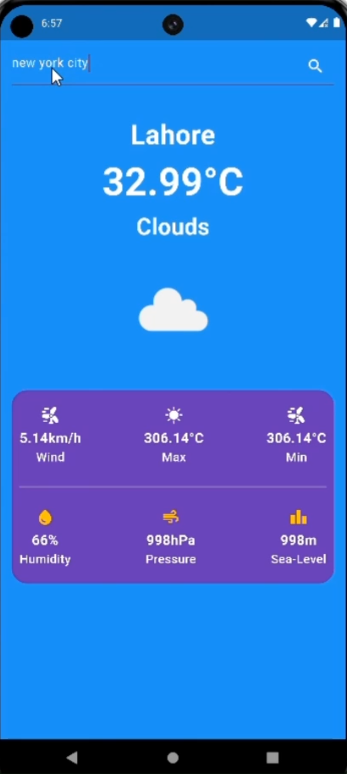

# Flutter Projects Collection 📱

Welcome to my Flutter projects repository! 🌟 This collection showcases my journey of learning Flutter, featuring various apps including a Google UI clone, a Weather App, a comprehensive To-Do App series, and the Shopsie App. Below are some screenshots of these projects.

## Projects

### 1. Google UI Clone


### 2. Weather App ☁️



### 3. To-Do App 📝

#### - Version 1

.png>)

#### - Version 2

.png>)

#### - Version 3

.png>)

#### - Version 4

.png>)

#### - Version 5

.png>)

#### - Version 6

.png>)

### 4. Shopsie App 🛍️

#### - Version 1

.png>)

#### - Version 2

.png>)

#### - Version 3

.png>)

#### - Version 4

.png>)

#### - Version 5

.png>)

#### - Version 6

.png>)

#### - Version 7

.png>)

#### - Version 8

.png>)

#### - Version 9

.png>)

#### - Version 10

.png>)

#### - Version 11

.png>)

#### - Version 12

.png>)

## How to Run

To explore any of these projects locally, clone the repository and navigate to the respective project folder. Run the app using Flutter commands.

```bash
git clone https://github.com/Abdur-Rehman-643/flutter_projects_collection.git
cd project_name
flutter run
```
